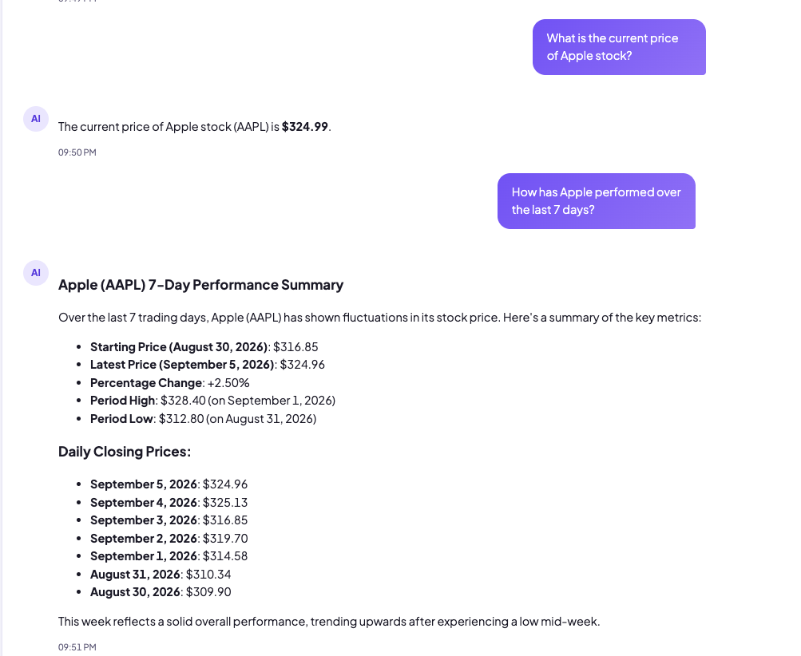
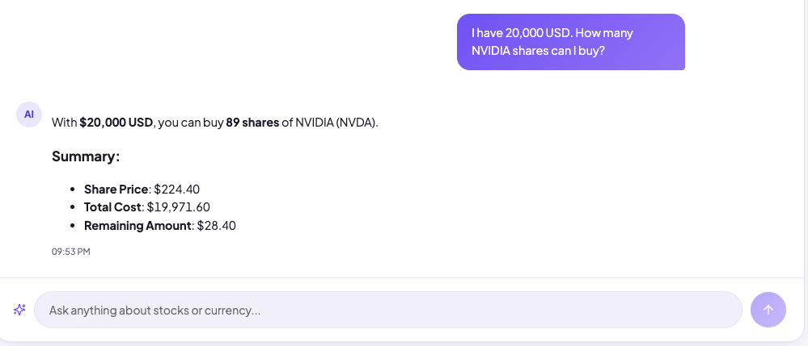

# 📈 MarketLens AI

**MarketLens AI** is an AI-powered market research assistant built with **Spring AI** and the **Model Context Protocol (MCP)**.

Instead of relying on the language model's internal knowledge for current market information, MarketLens lets the model select and call external tools for stock prices, historical market data, analyst information, foreign-exchange rates, and deterministic share calculations.

The project demonstrates practical **MCP tool discovery, tool calling, and multi-tool orchestration with Java and Spring AI**.

> **Disclaimer:** MarketLens AI is an educational and portfolio project. It provides market research and calculations, not personalized investment advice or trade execution.

---

## ✨ Features

- Current U.S. stock price lookup
- Historical stock performance and market reports
- Analyst recommendations and price-target data when available from the provider
- Currency conversion
- Whole-share purchase calculations
- Multi-tool orchestration from a single natural-language request
- Markdown-formatted conversational responses
- React-based market research interface

### Example questions

```text
What is the current price of Apple stock?
How has Apple performed over the last 7 days?
Give me a 2-week report on Microsoft.
What are analysts currently saying about NVIDIA?
Convert 5,000 CAD to USD.
I have 45,000 CAD. How many Apple shares can I buy?
I have 20,000 USD. How many NVIDIA shares can I buy?
```

---

## 🖥️ Demo

### Market research and historical reports



### Deterministic share calculation



---

## 🏗️ Architecture

```text
┌──────────────────────┐
│        User          │
└──────────┬───────────┘
           │
           ▼
┌──────────────────────┐
│    React Frontend    │
│        Vite          │
└──────────┬───────────┘
           │ HTTP
           ▼
┌──────────────────────────────┐
│     Spring Boot Client       │
│                              │
│  Spring AI ChatClient        │
│  OpenAI                      │
│  MCP Client                  │
└──────────────┬───────────────┘
               │ MCP
               ▼
┌──────────────────────────────┐
│      Spring MCP Server       │
│                              │
│  Stock Market Tools          │
│  Currency Tools              │
│  Calculation Tools           │
└───────────┬──────────┬───────┘
            │          │
            ▼          ▼
     ┌────────────┐ ┌──────────────┐
     │Twelve Data │ │ Frankfurter  │
     │ Market API │ │    FX API    │
     └────────────┘ └──────────────┘
```

The **AI client** handles conversation and reasoning. The **MCP server** owns integrations and deterministic tools. This keeps the LLM separated from external API implementation details.

---

## 🧠 MCP Tool Orchestration

A request can require more than one tool.

For example:

> **I have 45,000 CAD. How many Apple shares can I buy?**

```text
                    User Question
                         │
                         ▼
                        LLM
                    ┌────┴────┐
                    ▼         ▼
            convertCurrency  getPrice
               CAD → USD      AAPL
                    │         │
                    └────┬────┘
                         ▼
                 calculateShares
                         │
                         ▼
                Structured Result
                         │
                         ▼
                   LLM Response
```

The LLM decides which tools are needed and orchestrates them. Market values come from external services, while arithmetic such as whole-share quantity, total cost, and remaining balance is performed deterministically in Java.

---

## 🛠️ MCP Capabilities

### Stock market tools

The MCP server exposes tools for market research tasks including:

- Latest stock price
- Stock quote information
- Historical time-series data
- Analyst recommendations
- Analyst price targets

Stock-market data is retrieved from **Twelve Data**.

### Currency conversion

Foreign-exchange data is retrieved from **Frankfurter**. Currency arithmetic is handled in application code rather than delegated to the LLM.

### Share calculation

For share-purchase questions, MarketLens uses deterministic Java logic to calculate:

```text
available amount
      ÷
share price
      ↓
whole shares
      ↓
total cost + remaining amount
```

Amounts must be in the same currency before the share calculation is performed. For U.S. equities, non-USD funds are converted to USD first.

---

## 💬 Response Flow

MCP tools return structured data internally, while the final user-facing response remains flexible:

```text
External API
     ↓
MCP Tool
     ↓
Structured Java Object
     ↓
LLM
     ↓
Markdown Response
     ↓
React UI
```

This avoids forcing current-price questions, historical reports, currency conversions, and multi-tool calculations into one rigid response schema.

---

## ⚙️ Tech Stack

| Layer | Technology |
|---|---|
| AI client | Java, Spring Boot, Spring AI, OpenAI |
| Protocol | Model Context Protocol (MCP), Streamable HTTP |
| MCP server | Java, Spring Boot, Spring AI MCP Server |
| External integrations | OpenFeign, Twelve Data, Frankfurter |
| Financial arithmetic | Java `BigDecimal` |
| Frontend | React, Vite, React Markdown, CSS |

---

## 📁 Project Structure

```text
market-research-mcp/
├── client/                 # Spring AI application + MCP client
├── server/                 # MCP server + external API integrations
├── frontend/               # React/Vite UI
└── README.md
```

At runtime:

```text
frontend :5173
    ↓
client   :8080
    ↓ MCP
server   :8081
```

---

## 🚀 Running Locally

### Prerequisites

- Java 21
- Maven
- Node.js / npm
- OpenAI API key
- Twelve Data API key

### 1. Configure API keys

Set the required environment variables before starting the applications:

```bash
export OPENAI_API_KEY=your_openai_api_key
export TWELVE_DATA_API_KEY=your_twelve_data_api_key
```

Never commit real API keys to source control.

### 2. Start the MCP server

Start the server **before** the AI client so that MCP initialization can complete successfully.

```bash
cd server
mvn spring-boot:run
```

The MCP server runs on port `8081`.

### 3. Start the AI client

In another terminal:

```bash
cd client
mvn spring-boot:run
```

The client runs on port `8080` and connects to the MCP server.

### 4. Start the frontend

```bash
cd frontend
npm install
npm run dev
```

Vite typically serves the UI at `http://localhost:5173`.

---

## 🔐 Configuration & Security

API credentials should be injected through environment variables, for example:

```properties
spring.ai.openai.api-key=${OPENAI_API_KEY}
twelve.data.api-key=${TWELVE_DATA_API_KEY}
```

The MCP server does not require an OpenAI key because LLM interaction belongs to the AI client.

---

## 🧩 Key Design Decisions

### Why MCP?

MCP provides a clear boundary between LLM reasoning and external capabilities. The client does not need provider-specific implementation details; it discovers tools exposed by the MCP server and invokes them when needed.

### Why deterministic calculations?

The LLM is used for understanding requests, selecting tools, orchestrating calls, and explaining results. Financial arithmetic is performed with Java `BigDecimal`, keeping deterministic business logic outside the model.

### Why flexible natural-language responses?

Market questions have very different shapes. Keeping tool results structured while allowing the LLM to generate the final Markdown response makes the chat interface flexible without creating a separate frontend response schema for every use case.

---

## ⚠️ Current Limitations

- Data availability and freshness depend on upstream providers and subscription plans.
- Analyst information may not be available for every ticker.
- The project currently focuses primarily on U.S. equities.
- Historical investment simulations may require historical FX rates to model past cross-currency investments accurately.
- Tool orchestration depends on the model correctly interpreting the user's request and respecting currency requirements.
- MarketLens does not execute trades or provide personalized investment recommendations.

---

## 🌱 Future Improvements

- Historical FX support for investment simulations
- Rich stock-to-stock comparison reports
- Interactive historical price charts
- Improved company-name and ticker resolution
- Tool-call observability and tracing
- Response streaming
- Caching and resilience for external APIs
- Automated MCP tool-selection evaluation
- Additional market-data providers

---

## 🎯 Project Goal

MarketLens AI was built to explore practical **Model Context Protocol integration with Java and Spring AI**.

The focus is not simply retrieving stock prices. The project demonstrates how an LLM can serve as an orchestration layer across independently implemented tools while keeping data retrieval and deterministic calculations in application code.

```text
LLM           = reasoning + orchestration
MCP           = tool interface
Java          = deterministic business logic
External APIs = market data
React         = user experience
```

---

## 📄 Disclaimer

MarketLens AI is provided for educational and demonstration purposes only. Market information may be delayed, incomplete, or inaccurate. Nothing generated by this application should be considered financial or investment advice.
